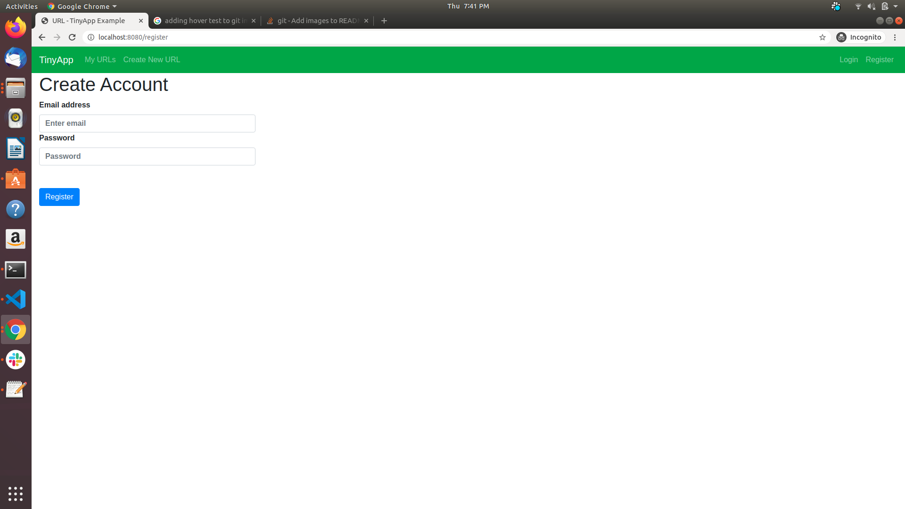
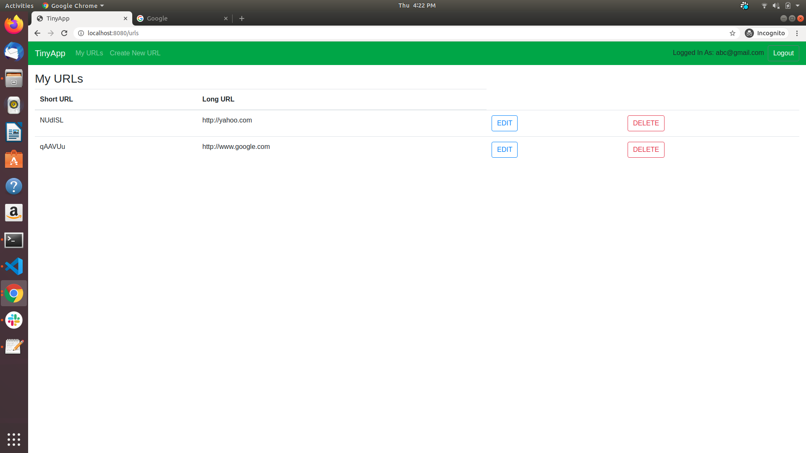
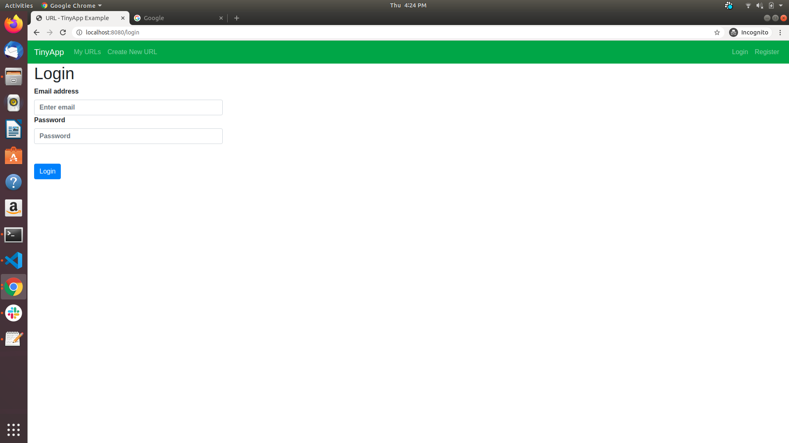
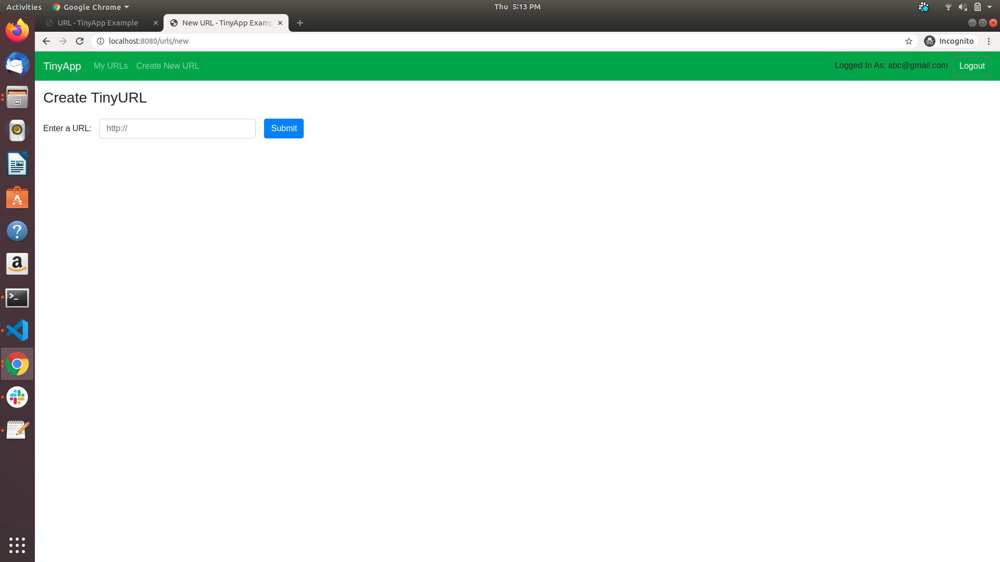
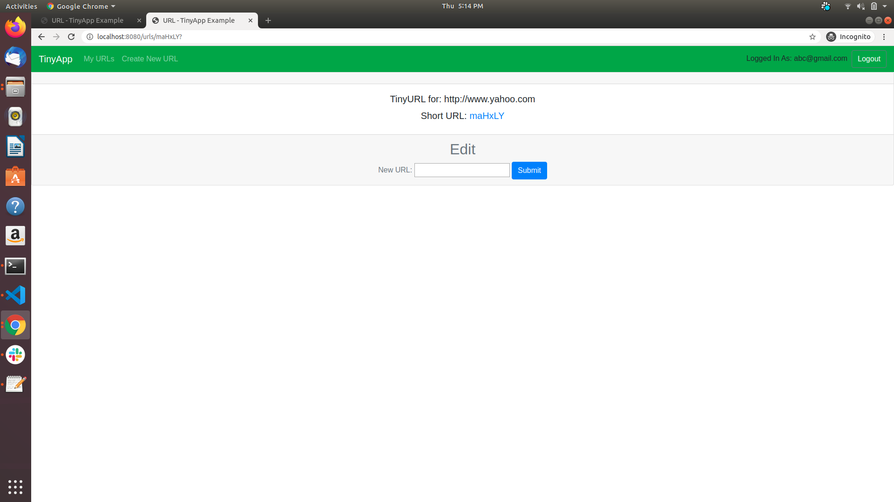

# TinyApp Project

TinyApp is a full stack web application built with Node and Express that allows users to shorten long URLs.

## Functionalities

- User has to register for using the application using the below url.(Needs to modify the ip and port of the server)
    <http://ip:port/>

- Once registered, login to the app to create urls
- Once created, users can edit and delete the urls
- Anybody can access the longurl from the short url using the below url
      <http://ip:port/u/shortURL>

## Final Product

## Dependencies

- Node.js
- Express
- EJS
- bcrypt
- body-parser
- cookie-session

## Getting Started

- Install all dependencies (using the `npm install` command).
- Run the development web server using the `node express_server.js` command.
